# Comp4222 Group18 Project Introduction

`Xiaopeng Wang, Huihao Jing, Hanning Zhang`

## 1.Background

Numbers matter. Considering the ubiquity of numbers and their basic differences. In other words, enabling NLP systems to effectively represent their benefits in fields such as science and finance, Literature, Digital understanding also helps detect sarcasm and analog conversations Involve price negotiations. d. While number is critical in these domains, most existing NLP models such as BERT are not designed explicitly to handle numbers.

## 2.Proposal

The topic of our project is related to knowledge graph embedding and construction. We plan to use knowledge graphs to increase the performance of traditional NLP tasks.

In traditional NLP tasks, when we are doing word embedding, we often convert it into vectors with numbers discarded. And such a method will sometimes perform undesired when we are focusing on the numbers that appear in the text, such as the financial datasets the paper on which we depend, the authors apply the TransE embedding to do the upstream task. In this project, we will continuously explore this direction. Our initial plan is to explore more embedding methods and find methods that will perform better Also, we will record the pros and cons of different models and analyzes the scenario they are the most applicable to. For the dataset, We're going to test our model with a classic medical scenario. Then we will evaluate it on a traditional NLP task to see whether we can outperform the existing approach. We will also try different loss functions, hoping to get a better strategy of learning. If time allows, we will play with several hyper-parameter of the knowledge graph, trying to finetune the model with better performance.

## 3.Methodology

The project will include some open source toolkit like OpenKe, Keras, ampligraph to make our model library rich enough, and use TSNE to preliminary visualize, review and filter the relatively ideal model. Then the selected number embedding methods will apply on the medical reality scenario together with the word2vec, to check whether this method is improving the performance of the original model facing numerically sensitive datasets.

## 4.Evaluation

- Core task: firstly, apply the Number Embedding based on Knowledge Graph method(NEKG) to embed numbers, and apply these number embeddings to a medical reality scenario to prove the usefulness of NEKG. Secondly, we'll try to analyze and  improve the existing knowledge graph embedding method(TransE) in NEKG by applying other more complex kg embeddding methods(Like TransD, TransH) or modifying TransE's loss function. We will evaluate each variants' performances based on list maximum, decoding, addition tasks which is used in the original paper and the medical downstream task mentioned above.

- Downstream task: based on the NEKG method, the original paper has shown its usefulness in a series of numeracy tasks. We want to show whether NEKG can improve the accuracy of nlp tasks in the real application. Therefore, we carry out a binary label task in a medical scenario. We have a medical dataset, where texts are notes commentting on the conodition of patients and labels are whether patients can leave the hospital. In the texts, there is an idicator called "gcs + a number" . It shows the degree of patient's coma and ranges from 1-14, which is closely related to whether patients can leave. From the intuition, we think including the number embedding can improve the result.

## 5.Code Structure

```
cd Final_project
```

Embedding: `./embedding`
database of the medical reality scenario: `df_with_gcs`
Performance database of the medical reality scenario: `./performance`
Toolkit to make embeddings: `./Openke`
probe task(Downstream task): `./probe_task`

## 6.Dataset

For the number embedding step, we construct a simple knowledge graph to train the embedding. And apply TSNE to preliminary visualize, review and filter the relatively ideal model

For the reality scenario task, we uses `df_with_gcs` that contains numbers. Its text data are notes commentting on the conodition of patients and labels are whether patients can leave the hospital. In the texts, there is an idicator called "gcs + a number" . It shows the degree of patient's coma and ranges from 1-14, which is closely related to whether patients can leave.

## 7.Result

### probe task performance
find the index of the maximum number in a list with 5 elements

number range: 0-999
-random: 0.7968
-TransE: 0.8442
-ComplEx: 0.8771
-Convolutional 2D KG Embeddings: 0.8355
-Convolution-based model: 0.8896
-Dismult: 0.8630
-Hole: 0.8697

number range: 0-99
-random: 0.9104
-TransE: 0.9229
-ComplEx: 0.9475
-Convolutional 2D KG Embeddings: 0.8976
-Convolution-based model: 0.9389
-Dismult: 0.9457
-Hole: 0.9398

#### TSNE performance

- TransE 1-999 100d(loss = 'self_adversarial')
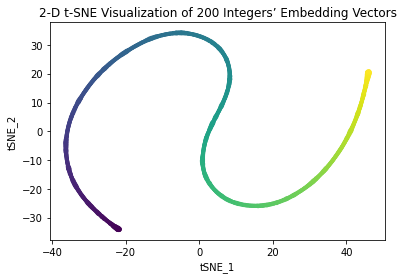
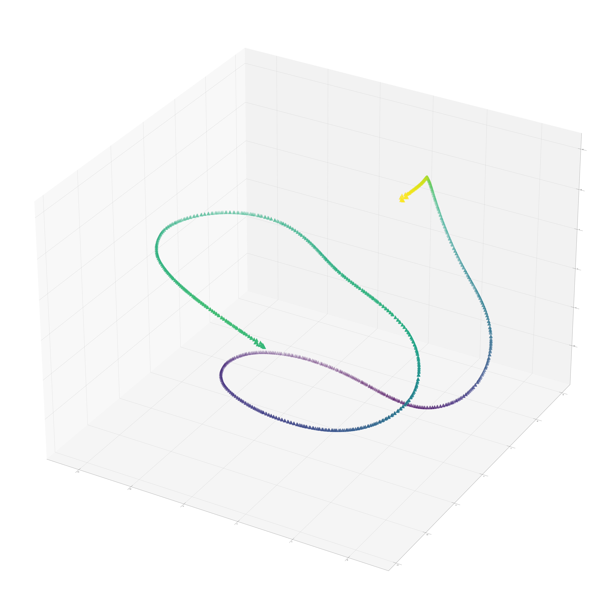

- HoleE 1-999 100d
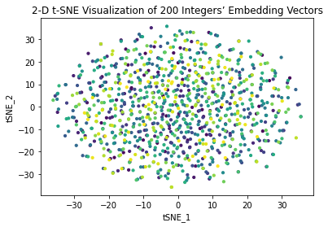
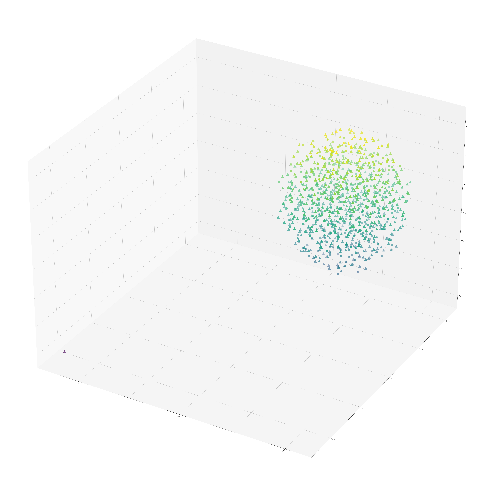

- DisMult 1-999 100d
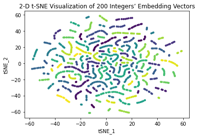
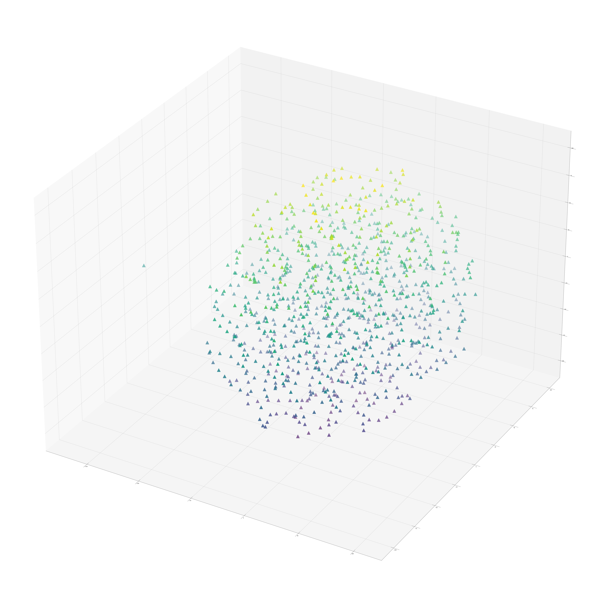

- ConvKB 1-999 100d
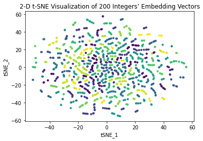
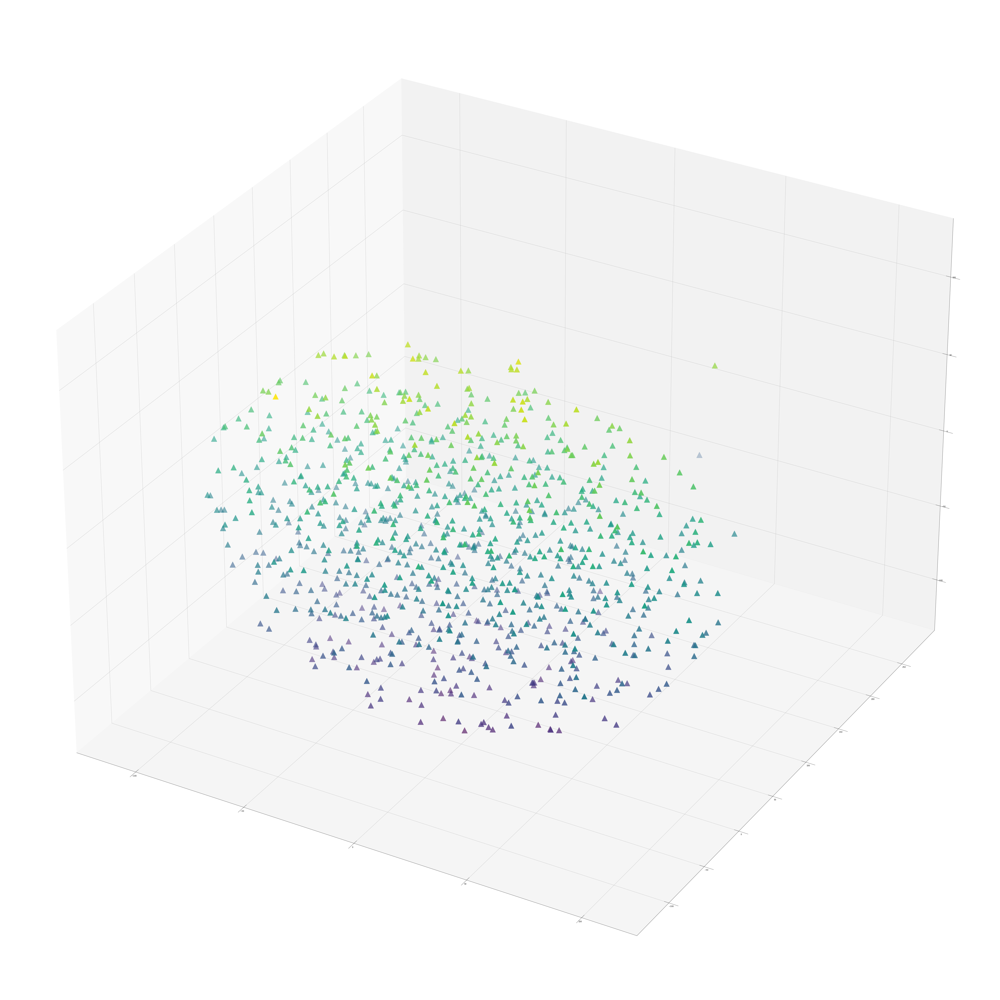

- ComplEx 1-999 100d
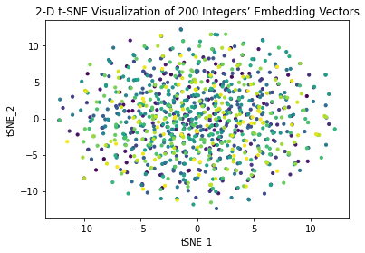
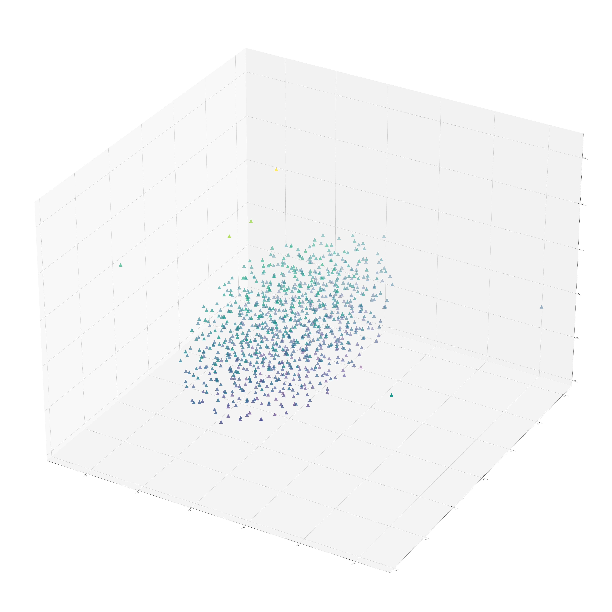

- Dice 1-999 100d
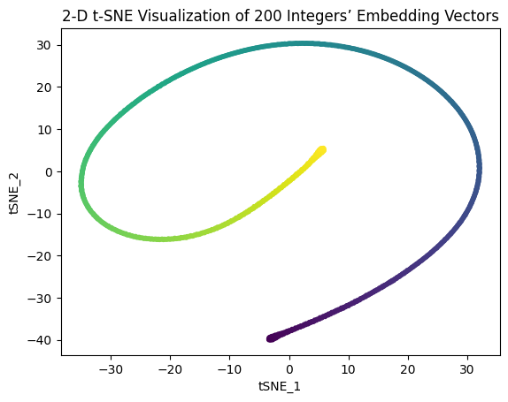


#### Istm-NEKG performance(After selection)

- `Baseline_1`: word2vec without NEKG (accuracy: 0.6757634878158569)

- `Baseline_2`: word2vec without random_number embedding (accuracy: 0.6894087062941657)

- `Model_1`: TransE 1-999 word2vec 100d (accuracy: 0.7179986900753446)

- `Model_2`: TransD 1-999 word2vec 100d (accuracy: 0.7128005226453146)

- `Model_3`: TransH 1-999 word2vec 100d (accuracy: 0.7179987033208212)

- `Model_4`: RESCAL 1-999 word2vec 100d adagrad (accuracy: 0.7063027951452467)

- `Model_5`: SimplE 1-999 word2vec 100d (accuracy: 0.7134502993689643)

- `Model_6`: Dice 1-999 word2vec 100d (accuracy: 0.7296946114963956)

## 8.Conclusion

we draw the following two main conclusions from our study  (1) we find that TransE is not stable when the number of entities is large, such as start=0, end=999, step=1. while some other embedding methods like ComlEx can relieve this problem. (2): we verufy that Number Embedding based on Knowledge Graph (NEKG) can improve downstream task's performance. (3): by changing the knowledge graph embedding method, both the downstrem task's accuracy and probe task's accuracy can be improved further.

