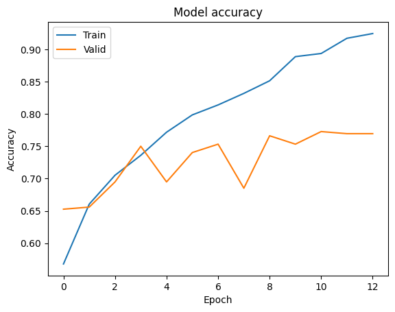

# Comp4222 Group18 Project Introduction

##### Xiaopeng Wang, Huihao Jing, Hanning Zhang

## 1.Background

Numbers matter. Considering the ubiquity of numbers and their basic differences. In other words, enabling NLP systems to effectively represent their benefits in fields such as science and finance, Literature, Digital understanding also helps detect sarcasm and analog conversations Involve price negotiations.

## 2.Proposal

The topic of our project is related to knowledge graph embedding and construction. We plan to use knowledge graphs to increase the performance of traditional NLP tasks.

In traditional NLP tasks, when we are doing word embedding, we often convert it into vectors with numbers discarded. And such a method will sometimes perform undesired when we are focusing on the numbers that appear in the text, such as the financial datasets the paper on which we depend, the authors apply the TransE embedding to do the upstream task. In this project, we will continuously explore this direction. Our initial plan is to explore more embedding methods and find methods that will perform better Also, we will record the pros and cons of different models and analyzes the scenario they are the most applicable to. For the dataset, We're going to test our model with a classic medical scenario. Then we will evaluate it on a traditional NLP task to see whether we can outperform the existing approach. We will also try different loss functions, hoping to get a better strategy of learning. If time allows, we will play with several hyper-parameter of the knowledge graph, trying to finetune the model with better performance.

## 3.Methodology

The project will Combined including some open source toolkit like OpenKe, Keras, ampligraph to make our model library rich enough, And use TSNE to preliminary review and filter the relatively ideal model, Then the selected embedding will apply on the medical reality scenario based on the word2vec model, to check whether this method is improving the performance of the original model facing numerically sensitive data sets.

## 4.Evaluation

- Core task: Apply the NEKG to do the numeracy embedding, and apply it to a medical reality scenario to check the score_list, for this task, the paper has explored the different performaance when applying different String-based methods, here we'll focus the specific word2vec model to be the basis of our model, we'll try to analysis and  improve the exicting embedding model(TransE) with applying other more complex embeddding(Like TransD, TransH)
- Downstream task: we will continue the work on the paper,''''''''''''''''

## 5.Code Structure

Embedding: ./embedding
df_with_gcs: database of the medical reality scenario
nekg.ipynb: 2 or 3 dimansions presentation of the Embendding
Performance database of the medical reality scenario: Istm***

## 6.Dataset

For the numeracy embedding step, we mock a 1000*100 DataFrame to train the embedding. And apply ISNE to preliminary review and filter the relatively ideal model

For the reality scenario test, we apply df_with_gcs which is a dataset that is highly sensitive to numbers

## 7.Result

#### TSNE performance

- TransE 1-999 100d(loss = 'self_adversarial')

- HoleE 1-999 100d

- DisMult 1-999 100d

- ConvKB 1-999 100d

- ComplEx 1-999 100d

- Dice 1-999 100d

#### Istm-NEKG performance(After selection)

- word2vec without NEKG (accuracy:0.670175439119339)

- TransE 1-999 word2vec 100d (accuracy:0.6859649181365967)

- TransD 1-999 word2vec 100d (accuracy:0.6970760285854339)

- TransH 1-999 word2vec 100d (accuracy:0.6970760285854339)

- RESCAL 1-999 word2vec 100d adagrad (accuracy:0.6865497171878815)

- SimplE 1-999 word2vec 100d (accuracy:0.6853801250457764)

- Dice 1-999 word2vec 100d (accuracy:0.689473682641983)

